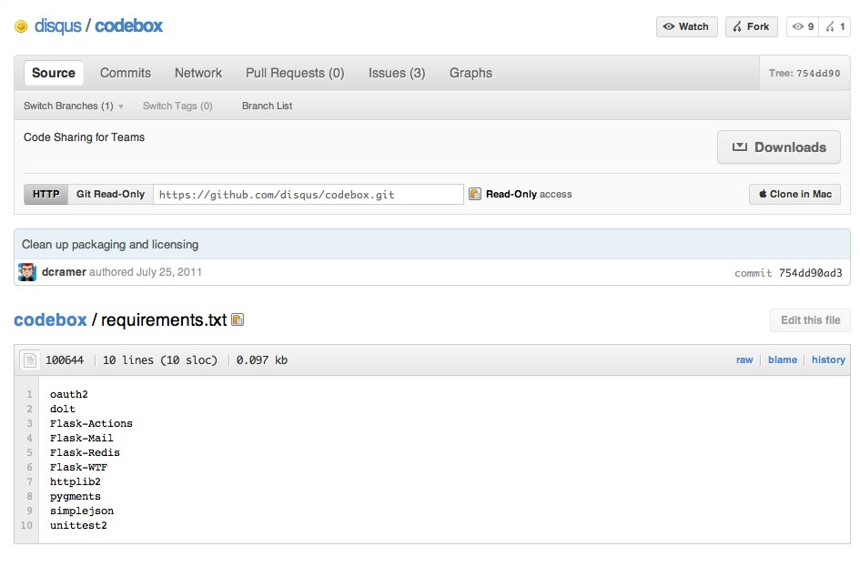
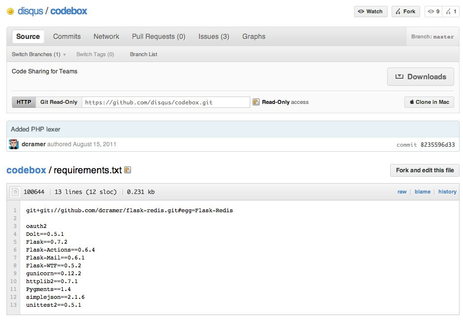
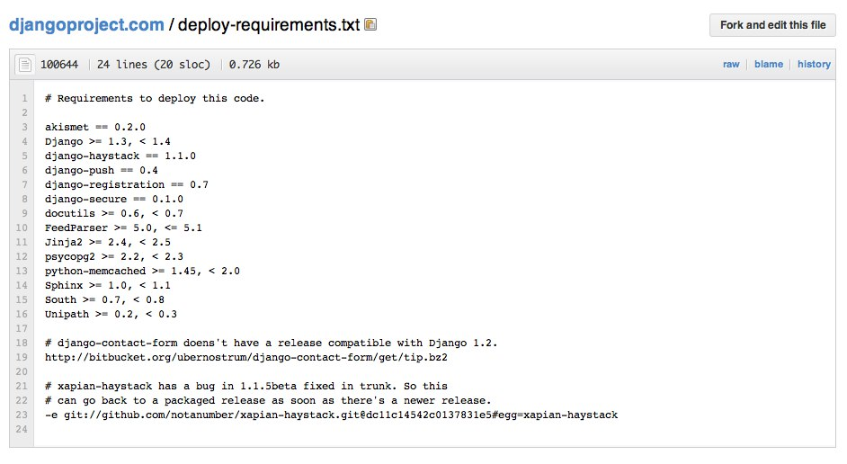

<!SLIDE incremental commandline >
# Pip and Virtualenv #

    $ virtualenv --no-site-packages .
    $ source bin/activate
    $ pip install flask

<!SLIDE >

.notes For some background, when we started beta testing Heroku's Python support, we reached out to a few people. This is one of the first apps that had been written elsewhere during a weekend hackathon, and was never intended to run on us. (As a quick aside, its a decent little lightweight app for internal code sharing). Think of it as a mix of github's gist, except public only to your internal company/groups.

<!SLIDE >

.notes The app had a requirements.txt that looked like this. Seems simple enough. However it was written a month or two earlier. A simple pip install now and starting the server resulted in several errors. If it doesn't work fresh locally it wont work deployed either.

<!SLIDE>

.notes Fast forward, now its running on us, and a git clone, pip install and runserver will now work for anyone. 

<!SLIDE>

.notes This isn't only the case for small one off weekend projects (though is surely common there), djangoproject.com suffers from a slightly lesser severe, but nonetheless similar case. While the earlier version of codebox had no versions, djangoproject.com specifies a range of version numbers. As a community we're really good about backwards compatability for minor versions, but we're by no means perfect. Please still don't so this.

<!SLIDE commandline incremental>
# Be Explicit #

    $ pip freeze > requirements.txt
    $ cat requirements.txt
    Django==1.3.1
	Jinja2==2.4.1
	Pygments==1.4
	South==0.7.3
	Sphinx==1.0.8
	Unipath==0.2.1
	akismet==0.2.0
	django-contact-form==0.3
	django-haystack==1.1.0
	django-push==0.4
	django-registration==0.7
	django-secure==0.1.0
	docutils==0.6
	feedparser==5.0.1
	psycopg2==2.2.2
	python-memcached==1.47
	wsgiref==0.1.2
	-e git://github.com/notanumber/xapian-haystack.git@dc11c14542c0137831e5c9c6c55ac4de21187414#egg=xapian_haystack-dev
	
.notes explicit is really the python way, we should be doing this for projects. 

