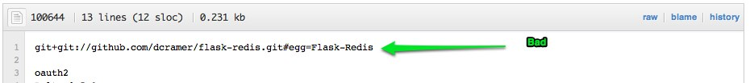

<!SLIDE>

* Github will go down
  * Github isn't a release even for your own project
 
* *Okay to use for development*

 

<!SLIDE>
# Point to an internal distribution #
    $ cat requirements.txt
    --find-links http://internal.example.com/sdists/

<!SLIDE>

## PyPi's Down 

    $ pip install --use-mirrors

<!SLIDE>
