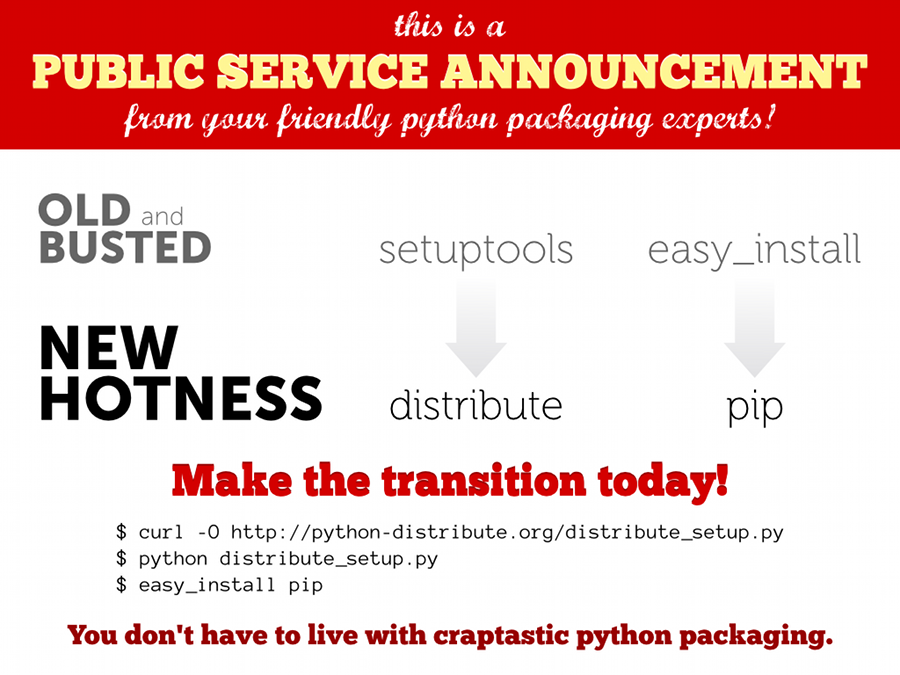

<!SLIDE>
# Packaging and Dependency Management #

<!SLIDE incremental>

* Packaging and Release

 
 
 
 

* Dependency Management

.notes Going to break this up into packaging and dependency management, most of us have some part in maintaining packages and releases, but we all without a doubt deal with dependency management

<!SLIDE incremental>
# Why it Matters #

* Rapid bootstrapping
* Predictable behavior
* Cloud deployment

.notes really quick boiler plate, but basically it matters. It can mean difference in working application and not, but without a doubt leads to rapidly boot strapping an environment and guarantees predictability

<!SLIDE center>

.notes just to lay the ground work, this is from the maintainers of many of the python packaging tools, but essentially we have two tools. Distribute for packaging, and pip for dependency management. And to throw in one other virtualenv. I'll get into more details on virtualenv later when we talk about dependency managemnts