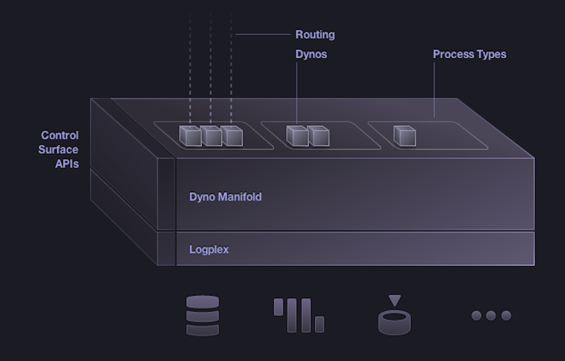

<!SLIDE>
# Deploying Java and Play! Apps on Heroku

## Jonathan Dance
## @wuputah
## wuputah.com

<!SLIDE>

# Heroku = Polyglot + PaaS + Cloud Components

## Forget servers and focus on building your app

<!SLIDE bullets>

# Polyglot

* Ruby
* node.js
* Clojure
* Java
* Play!

<!SLIDE bullets>

# Polyglot

* Scala
* Python

<!SLIDE bullets>

# Even

* PHP ... for Facebook

<!SLIDE>

# 350,000+ Apps Running on Heroku

<!SLIDE incremental>

# Cloud Application Platform

* HTTP Routing / Load Balancing
* Elastic Polyglot Runtime
* Management & Logging
* Component as a Service Ecosystem

<!SLIDE center>

<!SLIDE>

# Instant App Creation

## `heroku create --stack cedar`

<!SLIDE>

# Instant Deployment

## `git push heroku master`

<!SLIDE>

# Demo!

### java-workbook/tutorial-5

### Any questions?
