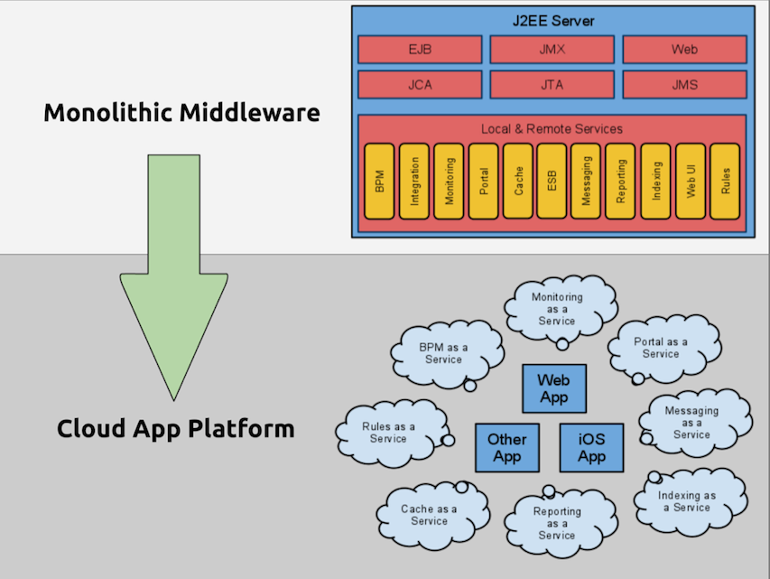

<!SLIDE>

# Getting Started with Java

### java-workbook/tutorial-1

<!SLIDE>

# Deploy an App on Heroku

1. Create a Java web app
2. Add a Procfile
3. Commit to a git repo
4. Create an app on Heroku
5. Upload to Heroku

<!SLIDE>

# Connect to a Database

* Free shared Postgres DB
* Dedicated & managed Postgres DB
* Amazon RDS: MySQL, Oracle
* NoSQL Addons: (Redis, MongoDB, etc)
* database.com
* Or anything else

<!SLIDE>

# Transform `DATABASE_URL`

## Heroku:
`postgres://[username]:[password]@[server]/[db-name]`

## JDBC:
`jdbc:postgresql://[server]/[db-name]?user=[username]&password=[password]`

## Transform:
`dbUrl = dbUrl.replaceAll("postgres://(.*):(.*)@(.*)/(.*)",
"jdbc:postgresql://$3/$4?user=$1&password$2");`

<!SLIDE>

# Demo!

### java-workbook/tutorial-2

<!SLIDE>

# Create a Worker Process

1. Create a process
2. Update the Procfile
3. Push to Heroku
4. Scale the workers

<!SLIDE>

# Demo!

### java-workbook/tutorial-3

<!SLIDE>

# Use a Heroku Addon

1. Find an addon: http://addons.heroku.com/
2. Activate the addon-on
3. Use the service
4. Push to Heroku

<!SLIDE>

# Demo with Redis!

### java-workbook/tutorial-4

<!SLIDE center>

<!SLIDE>

# Play! on Heroku

1. Create a Play! app
2. Add app to git repo
3. Create app on Heroku
4. Push to Heroku
